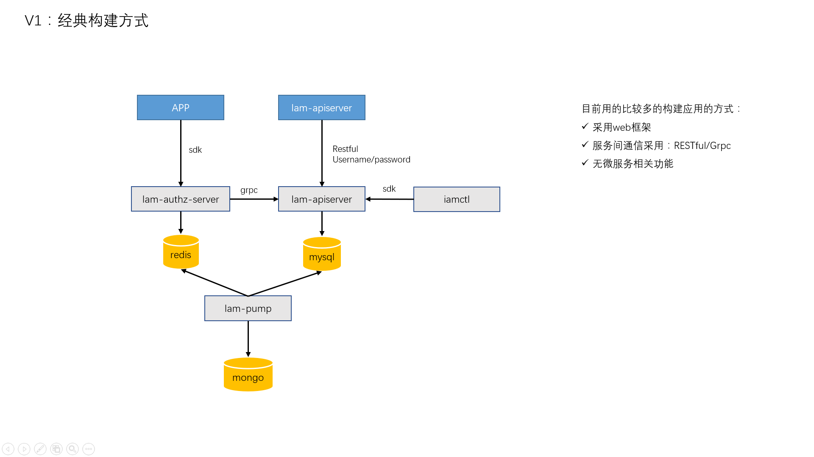
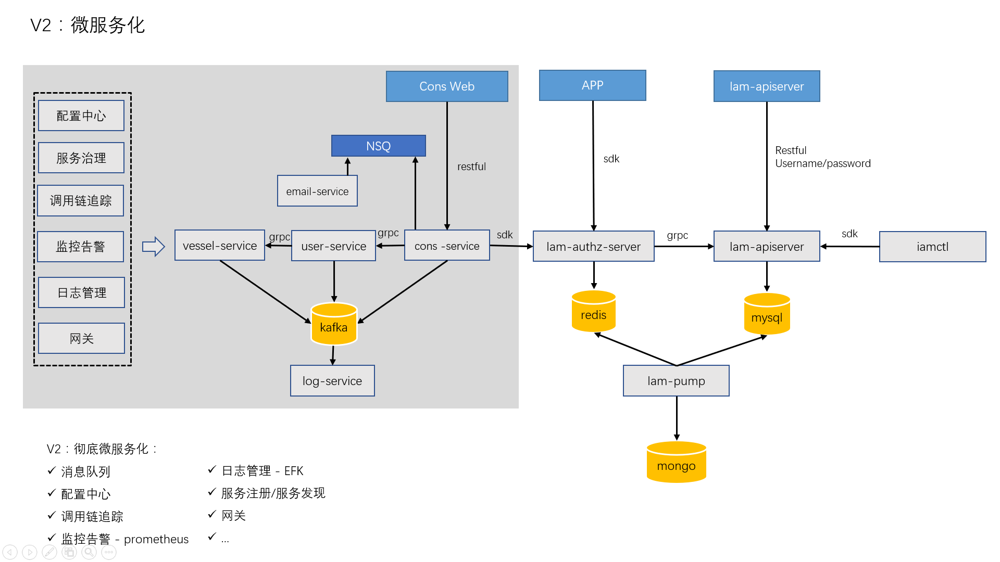
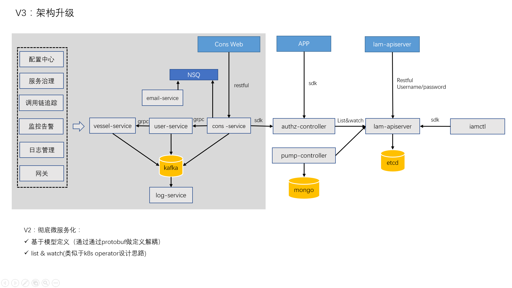

# Go项目demo feature需求收集

想写一个 go demo 项目，把 go 项目开发中的一些比较重要的特性都包含进去，这里收集一些功能需求和反馈，demo 今年内会上线。

大家可以提issue反馈，感谢大家！

大概可以分3个版本：

+ V1：经典构建方式

+ V2：微服务化

+ V3：架构升级

## 版本1
### 当前的 Feature(v1)

+ 开发环境配置
+ 代码结构和目录设计
+ 代码设计建议
+ 配置管理
+ Go常用包的使用
  + cobra
  + viper
  + gorm
  + gin
  + pflag
  + ...
+ HTTP
+ HTTPS
+ Web框架
  + Middleware
  + Router
+ 错误包设计
+ 错误代码设计
+ 客户端CLI设计
+ client-go风格的：SDK设计，支持：
  + username/password
  + token
  + tokenfile
  + secretid/secretkey
+ RESTful设计和实现
+ RESTful API设计规范
+ Grpc设计和实现
+ 数据库操作
+ 数据交互格式设计
+ Swagger文档
+ Cache机制设计
+ 业务逻辑处理
  + 参数读取、返回
  + 请求参数校验
  + 请求逻辑处理
+ API认证
  + SecretID/SecretKey
  + Token
  + Username/Password
+ 授权：基于RBAC/ACL的授权控制策略
+ 开发规范
  + 注释规范
  + 错误日志规范
  + Go开发规范
  + Go开发技巧
+ API调试
+ 测试
  + 单元测试
  + 功能测试
  + 性能测试
  + 性能分析
+ 部署方式
  + 物理机/虚拟机部署
  + Kubernetes部署
  + Serverless化部署
+ 云原生架构设计

### 待实现功能

+ Validate
  + gin binding 
  + custom validate
  + validate function
+ 打包：rpm、Dockerfile
+ A/B测试
+ 数据库同步
+ 限流
+ CLI增加分库分表功能
+ 验证码
+ 邮箱密码找回

## 待评估功能

+ Go项目发布变更流程

### 前端功能

+ vue?/react?

## 版本2

### Feature
+ 网关层/service mesh层
+ Graphql
+ Mongo支持
+ Crontab系统 -- nightwatch
+ JobFlow - 类似airflow的轻量级子系统
+ Webscoket

### 架构设计思路改变

+ 基于模型定义（通过protobuf做定义解耦）
+ list & watch(类似于k8s operator设计思路)

### 彻底微服务化
+ 消息队列
+ 配置中心
+ 调用链追踪
+ 监控告警 - prometheus
+ EFK
+ 服务注册/服务发现
+ 日志管理
